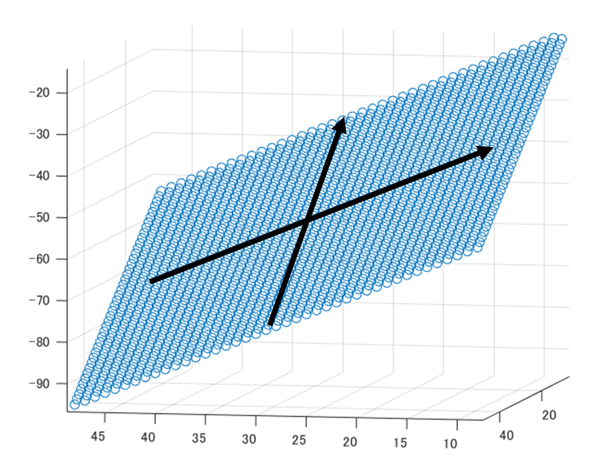
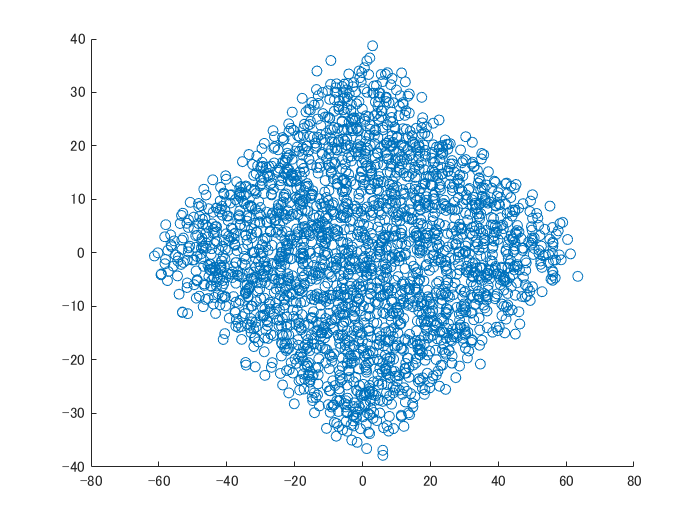
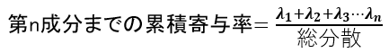
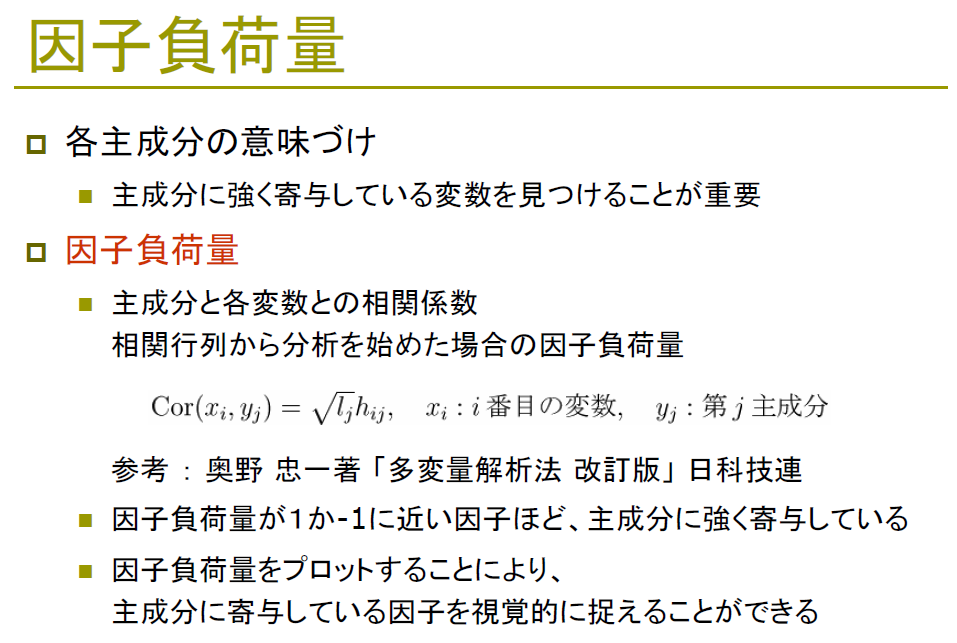

# 主成分分析 (Principal Component Analysis: PCA)を簡単に、かつわかりやすく説明したい
  
# 0章：はじめに

   -  この記事では、簡単に、かつわかりやすく、主成分分析や統計に関して初心者の方でも直感的に、かつある程度数式も合わせて理解できるようになることを目指しています。 
   -  筆者の勝手な理解をベースに執筆しているため、一部、曖昧な/厳密でない 表現があるかもしれません。 
   -  筆者の理解に従い、自身で主成分分析を1からコーディングし、数値計算のソフトウェアによって主成分分析をした結果とおおむね結果が一致していることを確かめています。これにより筆者の理解が正しいか確認いたしました。 
   -  もし間違いなどあれば教えていただけると幸いです。 

# 1章： 2次元や3次元で可視化して対象を捉えてみる
## 1-1 お土産にフルーツを買おう

例えば、お土産として、フルーツを友人宅に持っていくときのことを想像してください。どのフルーツを持っていくかを決定する方法としては、パッと浮かんだおいしいフルーツを買っていく、近くのスーパーに売っている旬のものを買う、友人と食べる夕食のメニューに合いそうなものを思い浮かべる、などがあると思います。メニューに合うように、味を考慮して選ぶとすれば、例えば、以下のように、グループ分けをすることも可能でしょう。思い浮かんだフルーツを、甘い/酸っぱいの基準にグループ分けし、甘いものがいいか、酸っぱいものがいいか、甘くて酸っぱいものがいいか、など考えることができます。甘くて、酸っぱくないものがいい、となれば柿などが候補になるでしょう。

  


実際に、上のようにグループ分けをしてフルーツを選ぶかどうかは人によるでしょう。しかし、複数の候補から最適なものを選んだり、複数の対象を関連付けて考えることにおいて、上のような関係性を可視化することは重要です。

例えば、上のグループ分けの図から

   -  ゆずとみかんは似た味の系統である 
   -  甘いものとしては、柿がある 
   -  甘さという観点において、柿とレモンは対極にある 
   -  アボカド（実はフルーツと区分される）は、他のフルーツとは、異なる味を持つ 

などのことを直感的に類推することができます。

## 1-2 3つの要素をもとにお土産を買う場合

次は、フルーツだけでなく、何か友人宅に持っていって喜ばれるものを考えます。先ほどと同様に、ここでは味のパターン分けをしてみます。先ほどの例に、「辛い」という基準が増え、辛さ、甘さ、酸っぱさという基準で考えることにします。

**ハラペーニョソース**：辛いと同時に少し酸っぱさがある

**キムチ**：辛いと同時に酸っぱさや少し甘さがある

**タコ焼き**：酸っぱくも辛くもないが、少しソースが甘口である

ということにして、さきほどのフルーツに上の候補を足しました。3つの軸で考えても、以下のような空間的な散らばりを考えると、どうにか3次元上でグループ分けすることも可能そうです。

  


## 1-3 4つ以上の特性を同時に考える場合

　これまでは、候補を独自の基準（甘さ、酸っぱさなど）でグループ分けし、可視化することで整理をしていました。お土産の品目を考える場合だけでなく、意思決定には基本的には複数の要素が混じるため、それぞれの候補を複数の「軸」をもとに比較することは重要です。例えば、パソコンを購入する場合、価格・OSの種類・計算速度・充電時間・見た目のかっこよさなど複数の条件をもとに意思決定をすると思います。

　しかし、そのように整理して考えたい場合に、そのときの候補が非常に多くの特性を有していると考えるのが難しくなります。そして、それらの値自体がどのような意味を持つのか直感的にわかりにくく、どの特性を重視して考えてよいかさえ明確でない場合も多くあると思います。（その例として、フルーツの栄養素（ビタミンB、ビタミンCなど）をもとに、それぞれのフルーツをグループ分けする例をこの先で扱います。）

　4つ以上の多くの要素をもつ対象を2次元の図のようにわかりやすく可視化して、対象をグループ分けしたり、それぞれの対象の近さ（例：ゆずとみかんは似ていそう）を概観する方法があると便利そうです。そのための手法として、この記事では**主成分分析**（Principal Component Anlysis: PCA）について述べます。主成分分析とPCAは同義ですが、本稿では、主成分分析という用語を用いることとします。

# 2章：主成分分析についてざっくりと
## 2-1 ここで考えるデータについて

　以下の表を見てください。フルーツとその栄養成分が示されています。この表の情報から、冒頭の「甘さ」・「酸っぱさ」の2つの軸で示したような図を作成することを目指します。少なくとも10以上の要素があるため、単に甘さや酸っぱさのみを基準にして2次元にプロットした図を作ることはできません。また、10個の軸をもって、可視化しようとしても、基本的に私たちは3次元の空間までしか認識できないため、そのまま可視化することはできません。


## 2-2 主成分分析を用いてフルーツのリストを2次元空間にプロットしてみる

　ひとまず、上のフルーツのリストの栄養成分の値に対して、主成分分析を行い、冒頭の「甘さ」と「酸っぱさ」の2軸の図**のような**図を作成します。「ような」とは、10個以上の変数（ここでは、栄養素）がある中でも、どうにかそれを2次元にプロットしたことを意味しています。以下の図を見てください。10個以上の栄養成分が表にあるため、直接的に可視化することは難しいと述べました。しかし、ここでは、各フルーツが2次元平面にプロットされています。例えば、オレンジで囲われたところでは、柑橘系のものが集中していることがわかります。赤で囲まれた、りんごとなしも直感的に近しいフルーツな気がします。ひとまずここでは、「なぜ？どうして？」は置いておいて、主成分分析なる手法を用いて、10次元以上のデータを「いい感じに」2次元にプロットできたと思っておいてください。

　また、x軸とy軸についても着目します。さきほどは、「甘さ」、「酸っぱさ」といった直感的な表現であった一方で、下図では、「PC1」、「PC2」という、ここでは初登場の用語が使われています。主成分分析を行って、栄養素のデータを変換したときの、1つ目の軸、2つ目の軸を示しています。ここでは、PC1, PC2などを**主成分軸**と呼びます。

  


## 2-3 バイプロットを用いた可視化

　前節の2-2では、PC1やPC2という用語や、各フルーツのプロットについて、詳しく記述していませんでした。以下に、主成分分析により、2次元平面にプロットしたときの結果と、PC1（x軸）、PC2（y軸）の値に寄与する成分を重ねた図（バイプロット）を示します。赤色で、カルシウムやビタミンといった栄養成分が書かれています。ここで気づくこととしては、

1) 原点（スタートとする）から、ビタミンCに到達するまでの直線（赤色）の向きはPC1（x軸）とPC2（y軸）ともに、プラスの向きを持っている

：ビタミンCの多い、レモンはPC1、PC2ともに、高い値を有している

2) 鉄はPC1（x軸）のプラスの向きを持っている

：なしは、栄養成分表によると、鉄分の含有量は0である。PC1に対して正の値をもつ鉄分に関して、鉄分の含有量のないフルーツは左側（PC1においては負の方向）に位置している。

3) 原点からカリウムやエネルギーまでの直線は、PC1についてはプラス、PC2については負の向きを有する

：バナナも同様に、高いPC1/低いPC2の値を有する。バナナはカリウムが高いことや、また、エネルギーが高いことで知られ、マラソンの前に食べられることも多い。

などがあります。ここでも尚、10次元以上の栄養データを持つ各フルーツが2次元にプロットされただけで、どうしてそうなったのかはまだわかりません。ただ、そのプロットにもどうやらルールがあって、各フルーツは、栄養価の持つベクトルやそのフルーツのもつ栄養価にそってプロットされていそうです。

（なお、ここでは、赤色のベクトルは、固有ベクトルをプロットしています。因子負荷量をプロットする場合も多くありましたが、今回は因子負荷量への変換は行っていません。）

$$

  
## 2-4 第一（第二）主成分と、固有ベクトルについて

前節の2-3で述べたことを言い換えると

   -  赤色で示される直線にカリウムやビタミンCなどの栄養成分が紐づいている 
   -  カリウムやビタミンCの含有量の多いフルーツとその直線は似た方向（位置）に存在する 

といったことでした。この節では、主成分分析に関わる用語も混ぜていきたいと思います。

上の図では、PC1やPC2という、x軸・y軸に相当するものが示されていました。これをそれぞれ**第一（第二）主成分**（またはその軸のことを主成分軸）といいます。多次元の情報（ここでいう、10種類以上の栄養成分）をもつサンプル（フルーツ）を2次元にプロット（写像）したときの値です。

　では、その第一主成分や第二主成分の値は何を持って決めるのでしょうか。そこで用いるのが、赤で示されたような、大きさと方向をもつ量（**ベクトル**）です。例えば、鉄分に対応するベクトルはPC1においては、正の値を有し、PC2（縦方向）においては、値は0に近い値を有しています。このベクトルのことを**固有ベクトル**といいます。鉄分の場合、PC1に対しては大きな値をPC2に対しては小さい値を持ちます。以下の図は、各栄養成分に対する固有ベクトルを示しています。先述したように、鉄では、PC1に関しては、比較的大きい値を有している一方で、PC2に関する値は非常に小さいことがわかります。


　このように、固有ベクトルは各栄養成分に対する値を持っています。そして第一主成分や第二主成分を計算するために、その固有ベクトルを用います。例えば、品種改良したバナナを現在扱うとします。そのバナナのエネルギーの値とPC1に対応するエネルギーの固有ベクトル（0.295724)を掛け算し、次はその品種改良されたバナナの炭水化物の値と0.265667を掛け算する、、、といったことをビタミンCまで繰り返し、その和がPC1の値になります。つまり、

（品種改良したバナナのPC1の値）＝（そのバナナのエネルギーの値）×（PC1のエネルギーに関する係数（＝0.2957））＋（そのバナナの炭水化物の値）×（PC1の炭水化物に関する係数（＝0.2656））＋ ... となります。このように、一次の式で合成し変数（合成変数）を作っていて、その係数はその合成変数にどの程度影響を与えているかを示しています。この合成変数のことを**主成分**と言います。

　同様にPC2に関しても、PC2の2段目の値を用いることでPC2の値も計算することができます。それにより、品種改良したバナナを上の図に新たにプロットすることができます。式にすると以下のようになります。

はバナナのエネルギーの値、はその係数（＝0.2957）です。他の文字も同様です。

 

（品種改良したバナナを新たに加えたい場合、そのサンプルを加えたうえで主成分分析をやり直すほうがよいのかもしれませんが、今回はあくまで計算の手順の例として示しています。）

## 2-5 第三成分以降について

　今回は、2次元上で可視化したいため、第二主成分までしか掲載していませんが、例えば、3次元上で可視化したい場合は、同様の手順で第三主成分も計算できます。以下のように、各主成分を計算するための固有ベクトルの値を示します。主成分分析では、2次元や3次元にプロットするだけでなく、ｎ次元の入力を、主成分分析をしてｎ次元（または10次元など）の別の値をもつデータに変換し、重回帰分析などに用いる場合もあります。


## 2章まとめ

2章では少しボリュームが多かったため、簡単にまとめます。

   -  2章では、主成分分析（PCA）によって、サンプル同士の関係を可視化する例について簡単に述べました。 
   -  主成分分析を用いて、4つ以上の変数がある場合でも2次元にプロットすることができました。 

ただ、ここでも尚、なぜ・どのように、10次元以上ある栄養データを2次元に、「いい感じに」プロットしたのかわかりません。ざっくりとした概要の話でしたが、次章以降は、より詳しい内容について数式を交えてまとめたいと思います。

# 3章：主成分分析を行う手順について

1章では、固有ベクトルなどを利用して、各フルーツの第一主成分や第二主成分（っぽいもの）を基準にグループ分けし、データが見やすくなることを紹介しました。確かに、その固有ベクトルをうまい具合に求めることができれば、情報を2次元に圧縮でき、サンプル同士の関係などを見ることができそうです。また、2章では、その第一主成分、第二主成分を作るための固有ベクトルなどを紹介しながら、主成分分析について深めてきました。ただ、その固有ベクトル自体はどのように求めればよいのでしょうか。また、主成分分析を行うにあたって、他に注意すべき事や見るべき指標はあるのでしょうか。

## 3-1 情報の縮約について

　次は、2次元の情報を1次元（直線）上に縮約することを考えます。以下の図を見てください。図中の5つのフルーツを甘さと丸っぽさに応じてプロットしてみました。甘さについては、各フルーツで違いがありますが、丸っぽさについては、どれも同じような形状をしていて、違いはないと思います。

　ここで、これらの5つのフルーツを2つ（丸っぽさ・甘さ）の指標ではなく、**1つの指標のみ**でかつ、**違いがわかるよう**に表したい場合はどうしたらよいでしょうか。例えば、フルーツかそうでないか、という指標を使うと、どれもフルーツなので、それらを見分けることができません。うまくそれぞれのフルーツの違いを残しつつ、少ない指標で各フルーツを表現したいです。


考えられる方法としては、以下のような表し方があるでしょう。甘さのみに絞って、以下のような直線上に並べます。


次に、丸っぽさを基準に表すとどうなるでしょうか。確かに柿よりゆずの方が丸っぽいのはわかりますが、グレープフルーツもみかんも同じくらい丸っぽく、この方式では、うまく情報を取り扱えていない印象があります。


甘さをもとに情報を縮約するほうがうまくできることは直感的にわかりましたが、どのように数式で表していけばよいのでしょうか。以下の図を見てください。甘さ方向では、情報に**散らばり**があるため、甘さという軸をもちいてフルーツを並べれば1つの指標（＝甘さ）のみで、かつ各フルーツを見やすくプロットすることができていました。一方、丸っぽさの軸にそった値は散らばりが少ないため、その軸にそって縮約しようとしても、各フルーツが重なってしまい、よいプロットができませんでした。


## 3-2 情報の散らばり（分散）について

　3-1では、各フルーツが散らばっている軸を用いて情報を縮約することで、1つの軸のみで各フルーツを表していました。ここでは、なじみのあるフルーツで説明していたため、直感的に丸っぽさよりも甘さを用いた方が各フルーツを見分けられることがわかったかもしれません。しかし、実際には、「丸っぽさより甘さを用いた方が、良さそうだ！」といった事前の情報もなく、単に数値から判断する必要があります。それでは、数値のみから最適な縮約の基準を求めるにはどうしたらいいでしょうか。

　それでは、具体的に、その散らばり具合を数値として計算し、最適な軸を選択していく準備をしていきます。以下の図を見てください。2.1でも扱いましたが、丸っぽさに関しては散らばりが小さく、甘さについては散らばりが大きいです。


　上で議論した、散らばりに関しては、**分散**という指標で表すことができます。分散の式は以下の通りです。


分散に関しては、以下の記事などがわかりやすかったです。

[https://bellcurve.jp/statistics/course/5924.html](https://bellcurve.jp/statistics/course/5924.html)

分散について、分解して考えてみます。

1) について

はi番目のサンプル（ここでは、レモン、グレープフルーツ、みかん、ゆず、柿）に対して計算を行っていることを示します。例えば、甘さの分散を調べるとき、i番目のサンプルがレモンだったとすると、レモンの甘さの値（厳密には糖度ですがここでは甘さの値とします）のことです。とはサンプル全体（ここでは、５つのフルーツの甘さ）の平均です。それで引き算を行うことで、i番目のサンプルの甘さがサンプル全体の平均と比べて、甘いのか（プラス）、甘くないのか（マイナス）を計算できます。

2) 2乗について

次は1)で計算した値を2乗します。ここでは散らばり具合を計算したいので、平均からみて、大きい値や小さい値が観測されるかどうかが重要です。散らばり具合においては、その平均からの差がどれくらいあるか知りたいです。単純にその差を足し算していくと、プラスとマイナスの要素が打ち消されて、0（＝散らばっていない）に近い、誤った計算結果になります。ここで2乗の計算をすることで、その符号の違いによる打ち消しを避けることができます。

3) Σについて

1)や2)の計算は、i番目のサンプルに対する計算でした、全てのサンプル（ここでは5つのフルーツ）に対して計算を行い、その平均からの差の2乗の値を足し合わせたいので、Σによって、n個のサンプルにわたって足し算をしていくことを示しています。

4) について

n個のサンプルに対して平均との差の2乗を計算し、足し合わせることを行いました。しかし、これだけでは、サンプル数が多いほど、その値は大きくなってしまいます。そのため、サンプル数にて割り算をします。

これにより、散らばり具合を分散として計算することができるようになりました。しかし、これだけでは、どのように固有ベクトルを計算するかなどはまだわかりません。次の3-3節では、2次元のプロットを例に、PC1やPC2の軸を作ることを考えます。

## 3-3 主成分の軸について

　3-2では単に、甘さの分散が大きいため、甘さという軸をそのまま用いていました。しかし、以下のような場合はどうでしょうか。横軸に甘さ、縦軸にオレンジっぽさ（黄色っぽさ）を示しています。次は、甘みだけでなく、色味においても分散が大きいです。同様に1つの軸のみで表現したい場合は、甘みだけでなく、色味もいい感じに利用して直線上で表したいですよね。色味でもばらついているので、その情報も用いたほうがより効果的そうです。

  


　そこで、以下の図のように、斜め方向に第一主成分を取ることを考えます。先ほどは、甘みの軸をそのまま第一主成分としていましたが、今回は、甘さと色味を合成して作成した第一主成分になります。


　以下の図に、第一主成分（太い青の矢印）を取り出したものを以下の図に示します。このように、第一主成分として、任意の方向をもつ軸を取ることができます。また、甘さの軸（x軸）での分散よりも、こちらの第一主成分における分散のほうが図大きいと想像できます。


## 3-4 第一および第二主成分への写像

　先ほどの図では、斜め方向に第一主成分をとりました。ここでは、それっぽく位置関係を保ったまま、第一主成分の図を作成しましたが、実際は、計算によって、（甘さ、色味）＝（x, y）の値を、(第一主成分、第二主成分）＝（z1, z2）の値に変換する必要があります。

　例えば、第一主成分の値z1を計算するために、甘みx1, 色味x2から以下のような式を考えます。


, は甘みx1, 色味x2にかける重みのようなものだと考えることができます。これは2-4で出てきた式と同様で、今回は2次元なので重みが2つしかないパターンです。

「新たな軸を作る」という凄そうなことをしている一方で、式は簡単な一次の線形結合で表されています。もう少し深めるために、以下の図を見てください。


  

左では、甘さと色味をもとにプロットしたもので、青色の矢印が、これから取る第一主成分軸を示しています。右側が、第一主成分、第二主成分が軸になるよう変換したものです。青色の軸から見ると、その軸まで各フルーツを垂直に下ろしてきた垂線の足の座標の値を第一主成分の値とし、第一主成分から各フルーツまでの距離を第二主成分の値としています。この第一主成分の原点とその垂線の足までの符号付きの距離のことを第1 **主成分得点**（スコア）といいます。

　上の言葉の説明はややこしいですが、端的に言うと、原点を中心に各フルーツを回転させて、その回転後のx軸、y軸をそれぞれ第一主成分、第二主成分の軸としていると言えると思います。回転による座標変換は行列で表すことができて、原点を中心に反時計回りにθ°回転する時の変換式は


で表せます。これを展開すると、


となります。y2についても同様です。上の例では、x1, y1がそれぞれ甘みと色味になるので、重み1×甘み＋重み2×色味という式の形で座標を回転させていますね。主成分分析の際も、重み1×変数1＋重み2×変数2 ... という形で、もとの入力の値を変換していきますが、このような1次の線形結合の式の形になることはなんとなく想像できるかと思います。

（なお、「主成分分析は直交変換だ」と言われますが、直交変換の中に、回転も含まれます。そのため、主成分分析自体が回転だと言っているわけではなく、わかりやすい例として回転を挙げ、それが一次の式で表されていることを述べました。）

また、さらに、この重み（など）には制約があって、


を満たす必要があります。この制約をクリアした上で、x・yなどの値を変換し、その変換した後の変数の分散が最大になるような重みを求めていきます。

以上から、主成分分析のための計算を行うときの大まかな手順として、

   1.  対象の変数の値を得る（さきほどは、甘さ、色味という2つの変数を扱ったが、実際は、3以上の変数がある） 
   1.  変数の変換に用いる重みである固有ベクトルを超能力で知ったとする 
   1.  2で知り得た固有ベクトルと1の入力を掛け合わせ、第一主成分、第二主成分、、、の値を取り出し、分散を計算する 
   1.  その分散がいろいろな固有ベクトルを取ったパターンの中で最大になっている 

といった流れだと嬉しいです。問題は2の固有ベクトルをどのように知るかということですね。これに関しては、ひとまず固有ベクトルを未知数としておいて、目的変数（4.の分散）が最大になるように、式の計算をしていけば、その固有ベクトルを求めることができそうです。方針としては、固有ベクトルをx（以下では違う文字を使う）として、分散の最大化を目指して式を微分していく感じになります。

# 4章：主成分分析の具体的な計算について
## 4-1 分散の計算について

　分散は2章で述べた通り、以下の式で求められます。


しかし、主成分分析の際は、行列で表した方がわかりやすく、行列で計算していく準備をしていきます。

例えば、以下のデータの分散を計算してみます。


分散を計算する際は、各サンプルから全体の平均を引き算していました。そのため、データの平均である5をデータの要素の数だけ用意します。これをデータとします。


すると、データXの各要素から平均5を引いた時の結果は以下のような式で表せます。その結果をとします。


つまり、先ほどの例では、以下のようになります。


そして、そのデータの分散は以下の式で計算できます。


Nはサンプルの数（3章では5つのフルーツを対象にしていたのでN=5）です。

これについて上の例を用いて補足します。

とはXを転置させたもので、


のことです。

を計算すると、


になって、行列の計算を行うと、


となります。分散の式

の2乗をして、総和Σを取るところまで、計算していることと等しいですね。

以下に、行列（Matrix）の計算がやりやすい、Matrix Laboratory (MATLAB)のコードを示します。

```matlab:Code
X=[-5:5]'; %-5から5まで（1刻み）の行列を作成
X'*X % Xの転置とXを掛け算する
```

```text:Output
ans = 110
```

結果が110となっていて、確かに正しい値が出ています。

最後にサンプル数であるNで割り算すると、分散を行列により求めることができます。


## 4-2 写像後の座標を計算する

　次は、多次元のデータを2次元などに写像するときの計算について述べます。写像に用いる固有ベクトルをaとします。これは2-5で示した表中の重みに等しいです。d次元まで存在すると以下のような式になります。主成分分析の表の見せ方によりますが、固有ベクトルの表の縦や横をなどとして考えると良いです。


データに対して計算を行うと、


になります。は写像後の各主成分の値です。ここではデータXではなく、その平均を引いた値であるを用いています。これは主成分分析の際に重要視する分散と関連付けるためです。これについては3.3で述べます。

## 4-3 写像後の座標の分散の計算

　写像した後の値sの分散 Var(s) を求めていきます。先ほどのデータXの例に沿って考えると、Xをそのままsに置き換えればよく、分散を求める式は以下のようになります。


また、sというのは、データにベクトルaをかけて求めたものなので、以下のようにも表せます。


また、という性質を用いて、


と書き換えることもできます。1/Nは単に数値なので順番を入れ替えることができます。これは1つ目の  の箇所に対して転置行列の性質を用いています。

転置行列の性質に関しては、以下の記事が参考になりました。

https://manabitimes.jp/math/1046

すると、という部分が見えるようになると思います。これはつまり、先ほど計算したに等しいですね。

そのため、で置き換えて、


となります。

3章で説明した通り、この分散が最大になっていれば嬉しい、ということでした。

そのため、 を最大化する固有ベクトルaの値を求めたいと思います。

さらに、aには


といった形（これはあくまで回転行列の例）のベクトルの大きさに対する制約を設けます。つまり、ここでは、aの大きさが1であるとします。

　逆に大きさの制約がなければ、そのaを1.1倍、1.2倍...という要領で無限にそれっぽい値が出てきてしまいます。

## 4-4 ラグランジュの未定乗数による固有ベクトルの計算

4-3で述べたように、の値を最大化するベクトルaを求める方法について考えます。

最大化する対象：

拘束条件：

です。

このような拘束条件のもと、目的変数を最大化する際は、ラグランジュの未定乗数法が有効です。

未定乗数法の簡単な例を以下に示します。ラグランジュ方程式を用意し、さらに、その式を各変数に対して偏微分を行います。

例えば、以下のような制約と目的となる値があれば、ラグランジュの未定乗数法にて解くことができます。


詳しい内容については、以下の記事などがわかりやすかったです。

[https://manabitimes.jp/math/879](https://manabitimes.jp/math/879)

  

上の例に沿って、ラグランジュ方程式を立てていきます。最大化したい値から、拘束条件にラグランジュ乗数をかけて引き算したものを以下に示します。はラグランジュ乗数 (Lagrange multiplier) です。


これを各変数で偏微分していきます。aについて偏微分を行うと以下のようになります。


ここでは、

を微分した値はであることを利用しています。

は2次形式で表されていて、その性質を用いています。

  

**2次形式について**

のように、次数が2の多項式で表される式の形

 という形で表すことができて、各種演算も簡単に実行できる。

例）を微分した値は 2Aw 　　

  

また、この右辺のの値が0になればよいので、右辺の値を0とすると、


を得ることができます。

ここで、とすると、


となります。

はじめにaは固有ベクトルであると述べました。この式の形は、

固有ベクトルを求める問題で見たことがある方も多いと思います。

固有ベクトルの求め方は、ページ数の都合上割愛させていただきます。固有ベクトルの求め方については以下のサイトがわかりやすかったです。

https://ai-trend.jp/basic-study/linear-algebra/eigenvalue-and-eigenvector/

ここまでの流れをまとめると

   \item{ 写像後の分散である、  の値を最大化したい }
   -  という拘束条件がある 
   -  ラグランジュの未定乗数法で解くことができる 
   -  固有値を求める問題に帰着した 
   -  固有値が求まる＝＞固有ベクトルが求まる 

となります。これまで分散の最大化や制約条件など、難しそうな話が出てきましたが、最終的には


を解けばよいというシンプルな問題に帰着しました。AはXから平均値を引いた行列の分散なので、データがあればすぐに求めることができます。あとは、シンプルな問題であれば手計算でも解けますし、プログラミング言語のパッケージを用いればすぐに固有値や固有ベクトルを求めることができます。この上の手順に従い、計算すれば、各主成分で分散が最大になるような固有ベクトルが得られて、それをもって任意の次元に写像できるはずです。また、この固有ベクトルがそれぞれの主成分軸の向きと一致します。次の章では、実際にコーディングもしながら確認していきたいと思います。

# 5章：3次元のデータに対して主成分分析を行う例

4.1では、1次元のデータの分散を求める例を示していました。基本的に、主成分分析は3次元以上のデータに対して行うため、この章では、3次元のデータに対してコーディングをしながら主成分分析を行いたいと思います。言語はMATLABを利用しますが、特にコードは見る必要がなく、結果とその説明だけ見ていただければ結構です。

### 5.1. 3次元データの生成

以下の媒介変数を用いた式を用いて、3次元上に平面っぽい点の分布を作ろうと思います。用いた平面の式は以下の通りです。


```matlab:Code
clear;clc;close all
x = 1:50; % xの値を1から50まで生成
y = 1:50; % yについても同様
[X,Y] = meshgrid(x,y); % 上の範囲で、グリッド状に点を生成
Z=1-X-Y; % 平面の式からそのx、ｙの地点でのzの値を計算
X=X(:); % 変数の型を縦長に変更
Y=Y(:); % 変数の型を縦長に変更
Z=Z(:); % 変数の型を縦長に変更
figure;scatter3(X,Y,Z) % プロット
```


すると、等しい間隔で点の並んだ、3次元のプロットを得ることができました。非常にこの平面に自分が立っていると想像してください。すると、その真上（真下）方向は変動せず、前と横方向しか変動していないですね。そのため、以下の図のように、2つの軸を取ればうまく2次元にデータを縮約できるのではないかと考えられます。



ノイズを加えて、ぼんやり平面が見えるくらいのデータに加工します。

```matlab:Code
X=X+rand(2500,1)*10;
Y=Y+rand(2500,1)*10;
Z=Z+rand(2500,1)*10;
figure;scatter3(X,Y,Z)
```


これにより、さきほどのくっきりとした平面ではなく、何となくそのデータに平面が隠れているようなプロットを得ることができました。次の項では、実際に主成分分析を行っていきます。直感的には、上の矢印で示したような主成分軸を取って、ほぼ（ノイズを乗せているため）2次元の平面に縮約できそうですね。

## 5.2. 主成分分析の実行
### 5.2.1. 自分で簡単に主成分分析を実装してみる

まずは、データの平均を引いて、を計算する必要がありました。ここでは、Xは3次元のデータです。文字がさきほどと被ってしまいますが、Xという変数にまとめてしまいます。

```matlab:Code
X=[X,Y,Z]; %X,Y,Z座標をXという1つのデータにまとめる
X=X-mean(X);
X(1:10,:) % 先頭から10個だけデータを表示する
```

```text:Output
ans = 10x3    
  -21.7379  -21.4437   45.5980
  -23.9124  -22.2096   48.6382
  -29.2875  -23.2099   51.4588
  -21.3041  -24.9932   50.8562
  -21.2549  -19.2303   44.0883
  -22.8871  -16.1058   48.5032
  -28.8589  -22.3273   43.9654
  -24.9624  -14.9185   40.4330
  -26.4127  -19.2797   45.7350
  -25.0727  -13.5144   39.5227

```

このようにN×3の形（ここでは、N=2500）が入力のデータの形です。

次は、分散の計算をします。以下の式で求められると述べていました。


MATLABでは、転置は単にX'と「'」を付ければよいです。Ｘはすでに平均を引いたものです。

```matlab:Code
X_var=1/2500*(X')*X
```

```text:Output
X_var = 3x3    
  215.0796   -0.1363 -209.4993
   -0.1363  217.4601 -209.1432
 -209.4993 -209.1432  429.2478

```

以上のように分散が計算できました。厳密には、共分散行列を計算することができました。

例えば、A組の身長測定の結果が、各生徒で、170 cm, 181 cm, 168 cm, ...180 cmだった場合、それらの分散は


で計算することができ、数値が1つ得られるというものでした。

しかし、今回は3次元のデータを扱っているので、その結果として、以下のような共分散行列を得ることができます。


対角成分は、x, y, zの分散で、それ以外は、各変数の共分散になっています。

共分散はざっくりいうとその変数同士が似ているかどうかで、その共分散から相関係数を出すことができます。


ここで、Xからその平均を引いたの分散（共分散行列）が求まれば、あとは以下の固有値問題を解けばいいのでした。


MATLABではeig関数で一発で求めることができます。このように固有値の問題を解いて、固有値を求めてくれました。なお、固有値は大きい順に出てこないこともあるのでその場合は、固有値、固有ベクトルを大きい順に並べなおす必要があります。今回はその操作は行っていません。

```matlab:Code
X_eig=eig(X_var)
```

```text:Output
X_eig = 3x1    
  637.3103
  216.4115
    8.0656

```

戻り値を2つ設定すると、固有ベクトルと固有値の両方を得ることができます。

```matlab:Code
[V,D] = eig(X_var)
```

```text:Output
V = 3x3    
   -0.4058    0.7045   -0.5823
   -0.4074   -0.7097   -0.5747
    0.8181   -0.0040   -0.5750

D = 3x3    
  637.3103         0         0
         0  216.4115         0
         0         0    8.0656

```

これにより、固有ベクトルを得ることができました（変数名はＶとしています）。最後に、入力のＸにＶを掛け合わせれば、各主成分に変換することができます。

```matlab:Code
score=X*V;
figure;scatter3(score(:,1),score(:,2),score(:,3))
xlim([-60,60]);ylim([-60,60]);zlim([-60,60]);
```


### 5.2.2. MATLABの関数を使って、検算してみる

MATLABの`pca`という関数を用いれば、一行で主成分分析を行うことができます。主成分スコアは、score2という変数に格納されているので、可視化してみます。自分で実装した、5.2.1の結果と同じになるはずです。

```matlab:Code
[coeff2,score2,latent2,tsquared2,explained,mu]  = pca(X);
figure;scatter3(score2(:,1),score2(:,2),score2(:,3))
xlim([-60,60]);ylim([-60,60]);zlim([-60,60]);
xlabel('x axis');ylabel('y axis');zlabel('z axis')
```


  

このように、どちらの場合も同じ結果を得ることができました。また、第三主成分軸は値が約0.58のものが3つ続いています。もとの平面がx+y+z=1で、法線ベクトルが(1,1,1)だったので、その法線ベクトルの向きに第二主成分軸を取っていることが確認できますね。

matlabの`pca`関数で求めた固有ベクトル

```matlab:Code
coeff2 
```

```text:Output
coeff2 = 3x3    
   -0.4058   -0.7045    0.5823
   -0.4074    0.7097    0.5747
    0.8181    0.0040    0.5750

```

さきほどの筆者の理解をもとに、自身で主成分分析を実装し、求めたときの固有ベクトル

```matlab:Code
V
```

```text:Output
V = 3x3    
   -0.4058    0.7045   -0.5823
   -0.4074   -0.7097   -0.5747
    0.8181   -0.0040   -0.5750

```

また、固有ベクトルを用いて、新たなPC1, PC2, PC3軸にプロットした時の値（主成分スコア）も一致していることがわかります（ベクトルの向きは正負が逆になることがあります）。初めから10個だけ取り出し、それを示します。

matlabの`pca`関数で求めた主成分スコア

```matlab:Code
score2(1:10,:)
```

```text:Output
ans = 10x3    
   54.8629    0.2770    1.2378
   58.5446    1.2775    1.2796
   63.4410    4.3654   -0.8033
   60.4349   -2.5266    2.4741
   52.5300    1.5017    1.9231
   55.5314    4.8868    5.3069
   56.7769    4.6598   -4.3552
   49.2873    7.1590    0.1403
   55.9904    5.1066   -0.1618
   48.0153    8.2296    0.3596

```

さきほどの筆者の理解をもとに、自身で主成分スコアを求めたときの結果

```matlab:Code
score(1:10,:)
```

```text:Output
ans = 10x3    
   54.8629   -0.2770   -1.2378
   58.5446   -1.2775   -1.2796
   63.4410   -4.3654    0.8033
   60.4349    2.5266   -2.4741
   52.5300   -1.5017   -1.9231
   55.5314   -4.8868   -5.3069
   56.7769   -4.6598    4.3552
   49.2873   -7.1590   -0.1403
   55.9904   -5.1066    0.1618
   48.0153   -8.2296   -0.3596

```

また、ノイズを乗せているため、完全ではないですが、XY平面からみると以下のように、主成分分析により、座標を変換したものは平面的になっていることがわかります。


## 6.6. 無相関化

主成分分析では、変換後の分散を最大化するべく、固有ベクトルを決定していました。変換後の変数（例：PC1）**内**の分散は最大化したとして、変数**間**の分散はどうなっているでしょうか。さきほど、3.5.2の冒頭で、入力からその平均を引いた、共の分散行列を示しましたが、変換後の共分散行列はどうなっているでしょうか。scoreという名前の変数が、主成分分析後の座標の値でした。その共分散行列を求めてみます。

```matlab:Code
(score-mean(score))'*(score-mean(score))
```

```text:Output
ans = 3x3    
1.0e+06 *

    1.5933   -0.0000   -0.0000
   -0.0000    0.5410   -0.0000
   -0.0000   -0.0000    0.0202

```

このように、対角成分は正の値を持っている一方で、それ以外の共分散の値は0になっています。

再び、共分散行列について示します。


このように、変数間の相関（のようなもの）は0になることがわかります。例えば、xとyの値をプロットしてみます。

```matlab:Code
figure;scatter(score(:,1),score(:,2))
```



```matlab:Code
mdl = fitlm(score(:,1),score(:,2));
disp(['決定係数は',string(mdl.Rsquared.Ordinary),'である'])
```

```text:Output
    "決定係数は"    "-2.2204e-16"    "である"
```

このように主成分分析後のxとyは相関がなく、決定係数も0になっていることがわかります。

このように主成分分析によって、変換された値（PC1、PC2...）どうしの相関は0になり、無相関化されます。

1章の可視化の例に加え、変数同士が相関しないように変換することも可能です。これは、例えば、重回帰分析に用いるデータにおいて、各変数に相関があるとうまくフィッティングできない場合があります（多重共線性）。これを避けるために

主成分分析が行われる場合があります。

# 7章 主成分分析について補足

4章では、具体的に3次元のデータで主成分分析を実行し、その挙動を確かめてきました。5章では、4章では紹介できなかった重要な事項について述べていきます。

## 7.1. 各主成分の説明性について
### 7.1.1. 累積寄与率と寄与率について

1章の例では、多次元の栄養データを2次元にプロットして可視化していました。4章の例を参考にすると、いろいろなデータで主成分分析を行うことができそうです。しかし、2次元にプロットすることは便利ですが、幾分か情報が失われているはずです。2次元では説明しきれない情報も多く存在しているはずで、その2次元のプロットによる可視化を中心に議論することの可否が気になるかと思います。その各主成分のもつ情報の割合を累積寄与率によって判断することができます。以下のように、各主成分の寄与率は、各主成分の分散を総分散で割ったものです。また、総分散とは各固有値の総和です（詳しくは後述する）。


i番目の固有値、総分散＝（各固有値の総和）

また、累積寄与率は、その成分までの和です。例えば、5次元のデータに対して、2つ目の成分までの寄与率は、1および2つ目の寄与率の和を全寄与率で割ったときの値です。しかし、固有値と分散が等しいとされており、わかりにくいです。これについて次の項で説明します。



累積寄与率は、以下のコマンドで求められて、さきほどの3次元プロットの例では、3次元までしかないため、3次元まで寄与率を足すと100になっていて、第一主成分のみでは73.5、第二主成分まででは、99となっています。この値が80を超えると、そのデータをうまく説明できている、という目安です。

```matlab:Code
cumsum(explained)
```

```text:Output
ans = 3x1    
   73.9522
   99.0641
  100.0000

```

### 7.1.2. 分散と固有値について

主成分分散では写像後の変数の分散を最大化するように定式化してきました。以下に、分散と、ラグランジュ方程式で出てきた固有値λは等価であることを示します。

まず、写像後の変数の分散は以下のように表せるのでした。


また、という性質を用いて、


この式の中央に、の分散の式が見えると思います。そのため、以下のように表せます。

 ...☆

一方、ラグランジュの未定乗数法の際、


この式が成り立っていました。この式に対して、左からをかけると、


になります。また、上の☆の式からわかるように、この式の左辺は、写像後の分散と一致しています。

つまり、写像後の分散は、であると言えます。

さらに、のλの値はスカラー（5とか10とか）なので、前に出すことができて、

　

になります。aは単位ベクトルで大きさが1なので、写像後の分散はλ、つまり固有値に等しいことがわかります。

  
## 7.2. 各主成分は直交するのか？

主成分分析では、各入力の値を、主成分ベクトルとの掛け算で変換していました。分散が最大になるような軸をとって、変換していたので、ある軸を主成分に取ると、次に分散が最大になるのは、これまで取った軸では表せない軸、つまり、直交している軸を主成分として取ることがよさそうです。実際に各主成分は直交しているのですが、そのことをこの節で示したいと思います。

　これまで述べたように、主成分分析では以下の図のように、分散が最も大きくなる向きに第一主成分軸を取り、その次に大きい分散の取れる軸を第二主成分軸とします。直感的には、第一主成分軸では表現できない方向を第二主成分軸で表現しようとすると、より大きな分散を取ることができそうです。

  


画像出典：株式会社インテージさま：主成分分析とは

[https://www.intage.co.jp/glossary/401/](https://www.intage.co.jp/glossary/401/)

  

ここでは、第一主成分軸と第二主成分軸が直交していることを示します。ただ、他の軸に対しても同様に説明できると思います。

ここでは、2つの固有ベクトルが直交することを示します。2つの固有ベクトルをx, yとします。

目標は、を示すことです。固有ベクトルx, yに対して以下の式が成り立ちます。

 ...★


2つ目の式に対して、両辺の転置行列を考えます。


ここで、に関しては、スカラーであるので、転置になっていません。

また、という性質を用いて、


になります。両辺をで割ると


になり、右からをかけます。


ここで、Aは共分散行列なのでです。そのため、


となり、★式より、


となります。スカラーであるを前に出して、


となります。

これらにより、


であり、式を整理して、


を得ることができました。であるとき、

　となります。

これにより各固有ベクトルは直交することが示されました。

  
## 7.3. 因子負荷量について

　1章のように、多次元の情報を第一主成分、第二主成分により、2次元でプロットすることでかなり情報が見やすくなりました。しかし、その場合、第一主成分や第二主成分は、どのような要素（例：第一主成分は炭水化物や脂質で主に構成されている）で成り立っているのかを知ることが、2次元でのプロットの解釈において非常に重要です。1章のバイプロットでは、単に固有ベクトルを表示していました。バイプロットではその固有ベクトルを表示させたり、または、この因子負荷量をプロットします。MATLABの公式ドキュメントでも、筆者の確認する限り、因子負荷量自体は、直接的にpca関数では計算されず、固有ベクトルをもって、各成分の寄与度を出していたように思いました。

以下のスライドは、統計科学研究所さまのスライドより引用しています。



引用：https://statistics.co.jp/reference/software_R/statR_9_principal.pdf

  
## 7.4. データの標準化について

主成分分析のために、

1) 入力からその平均を引く

2) 入力からその平均を引く、そして、標準偏差で割る

といった前処理をします。主成分分析の記事では、2）の場合が多い印象がありますが、絶対に標準偏差で割る必要はないようです。

非常にわかりやすい記事がありましたので、以下にURLを掲載いたします。https://qiita.com/koshian2/items/2e69cb4981ae8fbd3bda\#%E6%A8%99%E6%BA%96%E5%8C%96%E3%81%99%E3%82%8B%E3%83%87%E3%83%A1%E3%83%AA%E3%83%83%E3%83%88%E6%A8%99%E6%BA%96%E5%8C%96%E3%81%97%E3%81%AA%E3%81%84%E3%83%A1%E3%83%AA%E3%83%83%E3%83%88

また、入力からその平均を引かない場合でも、固有値や固有ベクトルの値は変わりません。共分散行列を求める際に、どっちみちその平均で引き算をするためです。

# 8章：まとめ

   -  この記事では、主成分分析を簡単な例を交えて説明しました。 
   -  分散を最大化するように新たな主成分軸をとり、固有ベクトルにより変換することで、点を写像することができました。 
   -  主成分分析は、データの可視化だけでなく、データの次元圧縮や、多重共線性を避けるための前処理など、様々な用途があるため、有効に使っていきたいと思います。 

# 参考文献

宮田先生 Rを用いた主成分分析

http://www1.tcue.ac.jp/home1/ymiyatagbt/principal.pdf

統計科学研究所

https://statistics.co.jp/reference/software_R/statR_9_principal.pdf

VIVINKO：主成分分析の基礎

[https://vivinko.com/inoue/docs/datascience/pca](https://vivinko.com/inoue/docs/datascience/pca)

關戸先生 データ分析入門 第10回 主成分分析

[http://www-is.amp.i.kyoto-u.ac.jp/data/sekido/20161213.pdf](http://www-is.amp.i.kyoto-u.ac.jp/data/sekido/20161213.pdf)
