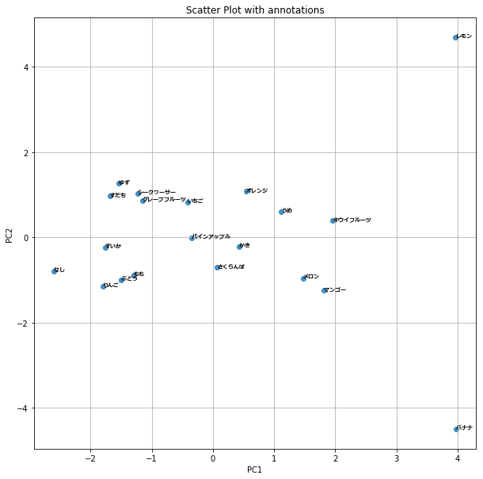
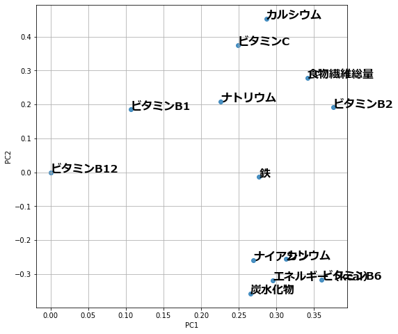
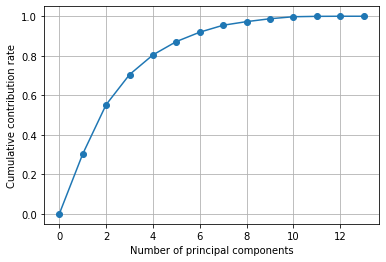
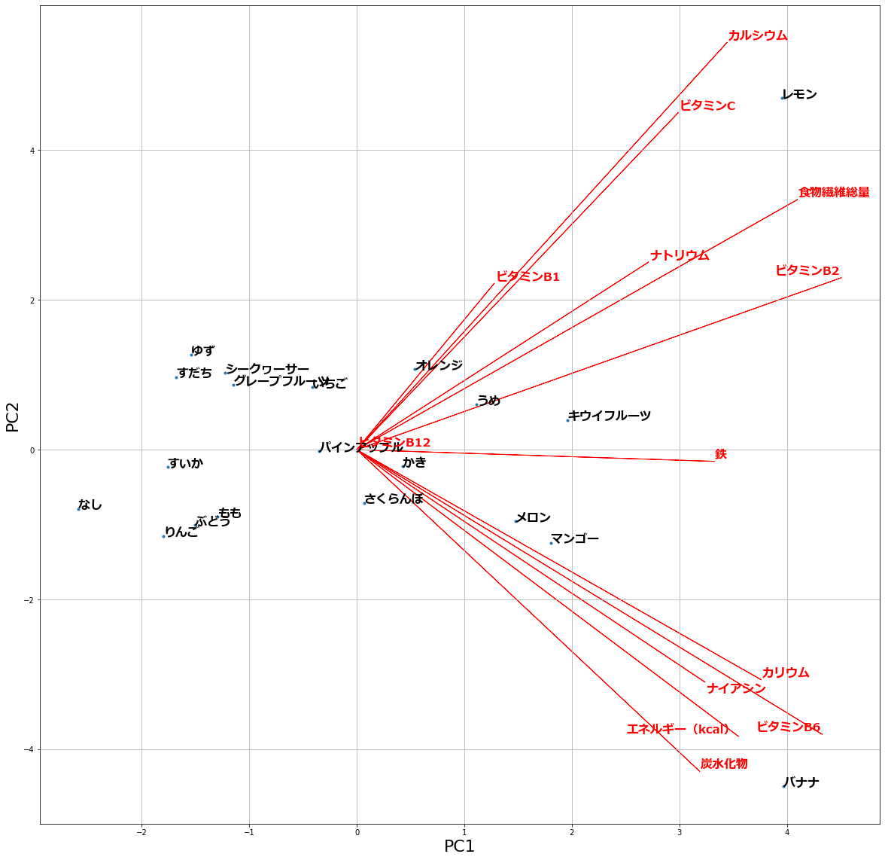

# 主成分分析によるデータの可視化
この記事では、主成分分析（PCA）を用いて、栄養データを2次元にプロットし、データ同士の関係を見るということを行います。  
主成分分析の詳しい内容については、[こちら](https://github.com/KentaItakura/blog-post-about-PCA)のページを見ていただけると幸いです。


コードについては、以下のページを参考に作成されていただきました。  
# 参考ページ  
主成分分析を Python で理解する  
https://qiita.com/maskot1977/items/082557fcda78c4cdb41f  
【python】pythonで主成分分析のバイプロット  
https://www.haya-programming.com/entry/2018/03/28/231305

# 解析に用いるデータ  
文部科学省により、公表されている、日本食品標準成分表をもとにデータ分析を行っていきます。ここでは、食品の成分が記載されていますが、今回はフルーツを対象として行いたいと思います。また、フルーツも筆者のほうで、スーパーによく売られていると思われるものを選定しました。このデータは、dataというフォルダの中に格納されています。  
https://www.mext.go.jp/a_menu/syokuhinseibun/1365420.htm  

  
    
## モジュールのインポート


```python
# 数値計算やデータフレーム操作に関するライブラリをインポートする
import numpy as np
import pandas as pd
# 図やグラフを図示するためのライブラリをインポートする。
import matplotlib.pyplot as plt
%matplotlib inline
#matplotlibにて、日本語のテキストを表示するためにロードする
from matplotlib.font_manager import FontProperties
fp = FontProperties(fname=r'C:\WINDOWS\Fonts\meiryob.ttc', size=16) 
#機械学習のライブラリのロード
import sklearn # scipyのバージョンのせいで、エラーが出る場合がある。
from sklearn.decomposition import PCA #主成分分析に用いる
```

## データのロード  
栄養成分表を読み込み、一部を表示してみます。


```python
data=pd.read_csv('./data/fruits_nutrition_components.csv', encoding="shift-jis")
data.head(12)
```


<div>
<style scoped>
    .dataframe tbody tr th:only-of-type {
        vertical-align: middle;
    }

    .dataframe tbody tr th {
        vertical-align: top;
    }

    .dataframe thead th {
        text-align: right;
    }
</style>
<table border="1" class="dataframe">
  <thead>
    <tr style="text-align: right;">
      <th></th>
      <th>fruit_name</th>
      <th>エネルギー（kcal）</th>
      <th>炭水化物</th>
      <th>食物繊維総量</th>
      <th>ナトリウム</th>
      <th>カリウム</th>
      <th>カルシウム</th>
      <th>鉄</th>
      <th>ビタミンB1</th>
      <th>ビタミンB2</th>
      <th>ナイアシン</th>
      <th>ビタミンB6</th>
      <th>ビタミンB12</th>
      <th>ビタミンC</th>
    </tr>
  </thead>
  <tbody>
    <tr>
      <th>0</th>
      <td>いちご</td>
      <td>34</td>
      <td>8.5</td>
      <td>1.4</td>
      <td>0</td>
      <td>170</td>
      <td>17</td>
      <td>0.3</td>
      <td>0.03</td>
      <td>0.02</td>
      <td>0.4</td>
      <td>0.04</td>
      <td>0</td>
      <td>62</td>
    </tr>
    <tr>
      <th>1</th>
      <td>うめ</td>
      <td>28</td>
      <td>7.9</td>
      <td>2.5</td>
      <td>2</td>
      <td>240</td>
      <td>12</td>
      <td>0.6</td>
      <td>0.03</td>
      <td>0.05</td>
      <td>0.4</td>
      <td>0.06</td>
      <td>0</td>
      <td>6</td>
    </tr>
    <tr>
      <th>2</th>
      <td>かき</td>
      <td>60</td>
      <td>15.9</td>
      <td>1.6</td>
      <td>1</td>
      <td>170</td>
      <td>9</td>
      <td>0.2</td>
      <td>0.03</td>
      <td>0.02</td>
      <td>0.3</td>
      <td>0.06</td>
      <td>0</td>
      <td>70</td>
    </tr>
    <tr>
      <th>3</th>
      <td>オレンジ</td>
      <td>46</td>
      <td>11.8</td>
      <td>1.0</td>
      <td>1</td>
      <td>180</td>
      <td>24</td>
      <td>0.2</td>
      <td>0.07</td>
      <td>0.04</td>
      <td>0.3</td>
      <td>0.06</td>
      <td>0</td>
      <td>60</td>
    </tr>
    <tr>
      <th>4</th>
      <td>グレープフルーツ</td>
      <td>38</td>
      <td>9.6</td>
      <td>0.6</td>
      <td>1</td>
      <td>140</td>
      <td>15</td>
      <td>0.0</td>
      <td>0.07</td>
      <td>0.03</td>
      <td>0.3</td>
      <td>0.04</td>
      <td>0</td>
      <td>36</td>
    </tr>
    <tr>
      <th>5</th>
      <td>シークヮーサー</td>
      <td>25</td>
      <td>7.9</td>
      <td>0.3</td>
      <td>2</td>
      <td>180</td>
      <td>17</td>
      <td>0.1</td>
      <td>0.08</td>
      <td>0.03</td>
      <td>0.3</td>
      <td>0.03</td>
      <td>0</td>
      <td>11</td>
    </tr>
    <tr>
      <th>6</th>
      <td>すだち</td>
      <td>20</td>
      <td>6.6</td>
      <td>0.1</td>
      <td>1</td>
      <td>140</td>
      <td>16</td>
      <td>0.2</td>
      <td>0.03</td>
      <td>0.02</td>
      <td>0.2</td>
      <td>0.08</td>
      <td>0</td>
      <td>40</td>
    </tr>
    <tr>
      <th>7</th>
      <td>ゆず</td>
      <td>21</td>
      <td>7.0</td>
      <td>0.4</td>
      <td>1</td>
      <td>210</td>
      <td>20</td>
      <td>0.1</td>
      <td>0.05</td>
      <td>0.02</td>
      <td>0.2</td>
      <td>0.02</td>
      <td>0</td>
      <td>40</td>
    </tr>
    <tr>
      <th>8</th>
      <td>レモン</td>
      <td>54</td>
      <td>12.5</td>
      <td>4.9</td>
      <td>4</td>
      <td>130</td>
      <td>67</td>
      <td>0.2</td>
      <td>0.07</td>
      <td>0.07</td>
      <td>0.2</td>
      <td>0.08</td>
      <td>0</td>
      <td>100</td>
    </tr>
    <tr>
      <th>9</th>
      <td>キウイフルーツ</td>
      <td>53</td>
      <td>13.5</td>
      <td>2.5</td>
      <td>2</td>
      <td>290</td>
      <td>33</td>
      <td>0.3</td>
      <td>0.01</td>
      <td>0.02</td>
      <td>0.3</td>
      <td>0.12</td>
      <td>0</td>
      <td>69</td>
    </tr>
    <tr>
      <th>10</th>
      <td>さくらんぼ</td>
      <td>60</td>
      <td>15.2</td>
      <td>1.2</td>
      <td>1</td>
      <td>210</td>
      <td>13</td>
      <td>0.3</td>
      <td>0.03</td>
      <td>0.03</td>
      <td>0.2</td>
      <td>0.02</td>
      <td>0</td>
      <td>10</td>
    </tr>
    <tr>
      <th>11</th>
      <td>すいか</td>
      <td>37</td>
      <td>9.5</td>
      <td>0.3</td>
      <td>1</td>
      <td>120</td>
      <td>4</td>
      <td>0.2</td>
      <td>0.03</td>
      <td>0.02</td>
      <td>0.2</td>
      <td>0.07</td>
      <td>0</td>
      <td>10</td>
    </tr>
  </tbody>
</table>
</div>


## 各種前準備

### 年代＋性別のラベルを作成する


```python
groupName=data['fruit_name']
print(groupName)
```

    0           いちご
    1            うめ
    2           かき　
    3          オレンジ
    4      グレープフルーツ
    5       シークヮーサー
    6           すだち
    7           ゆず　
    8           レモン
    9       キウイフルーツ
    10        さくらんぼ
    11          すいか
    12          なし　
    13    パインアップル　　
    14         バナナ　
    15         ぶどう　
    16       マンゴー　　
    17          メロン
    18           もも
    19          りんご
    Name: fruit_name, dtype: object
    

### 解析の対象とする範囲を設定する


```python
# energy以降のすべての要素を対象とする場合
# df_allVariants = data.iloc[:, 7::] 

# energyから、xx番目までの列を対象とする場合
df_allVariants = data.iloc[:, 1::]

# 選んだ対象を確認する
df_allVariants.head(10)
```


<div>
<style scoped>
    .dataframe tbody tr th:only-of-type {
        vertical-align: middle;
    }

    .dataframe tbody tr th {
        vertical-align: top;
    }

    .dataframe thead th {
        text-align: right;
    }
</style>
<table border="1" class="dataframe">
  <thead>
    <tr style="text-align: right;">
      <th></th>
      <th>エネルギー（kcal）</th>
      <th>炭水化物</th>
      <th>食物繊維総量</th>
      <th>ナトリウム</th>
      <th>カリウム</th>
      <th>カルシウム</th>
      <th>鉄</th>
      <th>ビタミンB1</th>
      <th>ビタミンB2</th>
      <th>ナイアシン</th>
      <th>ビタミンB6</th>
      <th>ビタミンB12</th>
      <th>ビタミンC</th>
    </tr>
  </thead>
  <tbody>
    <tr>
      <th>0</th>
      <td>34</td>
      <td>8.5</td>
      <td>1.4</td>
      <td>0</td>
      <td>170</td>
      <td>17</td>
      <td>0.3</td>
      <td>0.03</td>
      <td>0.02</td>
      <td>0.4</td>
      <td>0.04</td>
      <td>0</td>
      <td>62</td>
    </tr>
    <tr>
      <th>1</th>
      <td>28</td>
      <td>7.9</td>
      <td>2.5</td>
      <td>2</td>
      <td>240</td>
      <td>12</td>
      <td>0.6</td>
      <td>0.03</td>
      <td>0.05</td>
      <td>0.4</td>
      <td>0.06</td>
      <td>0</td>
      <td>6</td>
    </tr>
    <tr>
      <th>2</th>
      <td>60</td>
      <td>15.9</td>
      <td>1.6</td>
      <td>1</td>
      <td>170</td>
      <td>9</td>
      <td>0.2</td>
      <td>0.03</td>
      <td>0.02</td>
      <td>0.3</td>
      <td>0.06</td>
      <td>0</td>
      <td>70</td>
    </tr>
    <tr>
      <th>3</th>
      <td>46</td>
      <td>11.8</td>
      <td>1.0</td>
      <td>1</td>
      <td>180</td>
      <td>24</td>
      <td>0.2</td>
      <td>0.07</td>
      <td>0.04</td>
      <td>0.3</td>
      <td>0.06</td>
      <td>0</td>
      <td>60</td>
    </tr>
    <tr>
      <th>4</th>
      <td>38</td>
      <td>9.6</td>
      <td>0.6</td>
      <td>1</td>
      <td>140</td>
      <td>15</td>
      <td>0.0</td>
      <td>0.07</td>
      <td>0.03</td>
      <td>0.3</td>
      <td>0.04</td>
      <td>0</td>
      <td>36</td>
    </tr>
    <tr>
      <th>5</th>
      <td>25</td>
      <td>7.9</td>
      <td>0.3</td>
      <td>2</td>
      <td>180</td>
      <td>17</td>
      <td>0.1</td>
      <td>0.08</td>
      <td>0.03</td>
      <td>0.3</td>
      <td>0.03</td>
      <td>0</td>
      <td>11</td>
    </tr>
    <tr>
      <th>6</th>
      <td>20</td>
      <td>6.6</td>
      <td>0.1</td>
      <td>1</td>
      <td>140</td>
      <td>16</td>
      <td>0.2</td>
      <td>0.03</td>
      <td>0.02</td>
      <td>0.2</td>
      <td>0.08</td>
      <td>0</td>
      <td>40</td>
    </tr>
    <tr>
      <th>7</th>
      <td>21</td>
      <td>7.0</td>
      <td>0.4</td>
      <td>1</td>
      <td>210</td>
      <td>20</td>
      <td>0.1</td>
      <td>0.05</td>
      <td>0.02</td>
      <td>0.2</td>
      <td>0.02</td>
      <td>0</td>
      <td>40</td>
    </tr>
    <tr>
      <th>8</th>
      <td>54</td>
      <td>12.5</td>
      <td>4.9</td>
      <td>4</td>
      <td>130</td>
      <td>67</td>
      <td>0.2</td>
      <td>0.07</td>
      <td>0.07</td>
      <td>0.2</td>
      <td>0.08</td>
      <td>0</td>
      <td>100</td>
    </tr>
    <tr>
      <th>9</th>
      <td>53</td>
      <td>13.5</td>
      <td>2.5</td>
      <td>2</td>
      <td>290</td>
      <td>33</td>
      <td>0.3</td>
      <td>0.01</td>
      <td>0.02</td>
      <td>0.3</td>
      <td>0.12</td>
      <td>0</td>
      <td>69</td>
    </tr>
  </tbody>
</table>
</div>


### 行列の標準化  
今回は、各列の平均を引いて、さらに標準偏差で割っている。各列を平均0、標準偏差1に正規化している


```python
df_allVariants_norm = df_allVariants.apply(lambda x: (x-x.mean())/(x.std()+0.001), axis=0)
# 標準偏差で割らない場合
# df_allVariants_norm = df_allVariants.apply(lambda x: (x-x.mean()), axis=0)
df_allVariants_norm.head(5)
```


<div>
<style scoped>
    .dataframe tbody tr th:only-of-type {
        vertical-align: middle;
    }

    .dataframe tbody tr th {
        vertical-align: top;
    }

    .dataframe thead th {
        text-align: right;
    }
</style>
<table border="1" class="dataframe">
  <thead>
    <tr style="text-align: right;">
      <th></th>
      <th>エネルギー（kcal）</th>
      <th>炭水化物</th>
      <th>食物繊維総量</th>
      <th>ナトリウム</th>
      <th>カリウム</th>
      <th>カルシウム</th>
      <th>鉄</th>
      <th>ビタミンB1</th>
      <th>ビタミンB2</th>
      <th>ナイアシン</th>
      <th>ビタミンB6</th>
      <th>ビタミンB12</th>
      <th>ビタミンC</th>
    </tr>
  </thead>
  <tbody>
    <tr>
      <th>0</th>
      <td>-0.722073</td>
      <td>-0.890972</td>
      <td>0.124537</td>
      <td>-0.893118</td>
      <td>-0.268161</td>
      <td>0.141014</td>
      <td>0.791322</td>
      <td>-0.518407</td>
      <td>-0.339529</td>
      <td>0.314162</td>
      <td>-0.436554</td>
      <td>0.0</td>
      <td>1.108630</td>
    </tr>
    <tr>
      <th>1</th>
      <td>-1.086143</td>
      <td>-1.039881</td>
      <td>1.139283</td>
      <td>0.480909</td>
      <td>0.719801</td>
      <td>-0.202922</td>
      <td>3.052240</td>
      <td>-0.518407</td>
      <td>1.227528</td>
      <td>0.314162</td>
      <td>-0.187095</td>
      <td>0.0</td>
      <td>-0.890832</td>
    </tr>
    <tr>
      <th>2</th>
      <td>0.855565</td>
      <td>0.945572</td>
      <td>0.309036</td>
      <td>-0.206104</td>
      <td>-0.268161</td>
      <td>-0.409283</td>
      <td>0.037682</td>
      <td>-0.518407</td>
      <td>-0.339529</td>
      <td>-0.169164</td>
      <td>-0.187095</td>
      <td>0.0</td>
      <td>1.394268</td>
    </tr>
    <tr>
      <th>3</th>
      <td>0.006068</td>
      <td>-0.071973</td>
      <td>-0.244462</td>
      <td>-0.206104</td>
      <td>-0.127024</td>
      <td>0.622523</td>
      <td>0.037682</td>
      <td>1.209617</td>
      <td>0.705176</td>
      <td>-0.169164</td>
      <td>-0.187095</td>
      <td>0.0</td>
      <td>1.037221</td>
    </tr>
    <tr>
      <th>4</th>
      <td>-0.479359</td>
      <td>-0.617972</td>
      <td>-0.613460</td>
      <td>-0.206104</td>
      <td>-0.691573</td>
      <td>0.003439</td>
      <td>-1.469597</td>
      <td>1.209617</td>
      <td>0.182823</td>
      <td>-0.169164</td>
      <td>-0.436554</td>
      <td>0.0</td>
      <td>0.180309</td>
    </tr>
  </tbody>
</table>
</div>


## 主成分分析の実行

### `pca`関数を用いて、主成分分析を実行する


```python
pca = PCA()
pca.fit(df_allVariants_norm)
# データを主成分空間に写像 => このあと、各サンプルのPC1, PC2の値を取り出す
feature = pca.transform(df_allVariants_norm)
```

### 主成分得点の確認


```python
if  len(df_allVariants_norm.index) > len(df_allVariants_norm.columns):
    pca_score = pd.DataFrame(feature, columns=["PC{}".format(x + 1) for x in range(len(df_allVariants_norm.columns))]).head(20)
else:
    pca_score = pd.DataFrame(feature, columns=["PC{}".format(x + 1) for x in range(len(df_allVariants_norm.index))]).head(12)

pca_score.head(20)
```


<div>
<style scoped>
    .dataframe tbody tr th:only-of-type {
        vertical-align: middle;
    }

    .dataframe tbody tr th {
        vertical-align: top;
    }

    .dataframe thead th {
        text-align: right;
    }
</style>
<table border="1" class="dataframe">
  <thead>
    <tr style="text-align: right;">
      <th></th>
      <th>PC1</th>
      <th>PC2</th>
      <th>PC3</th>
      <th>PC4</th>
      <th>PC5</th>
      <th>PC6</th>
      <th>PC7</th>
      <th>PC8</th>
      <th>PC9</th>
      <th>PC10</th>
      <th>PC11</th>
      <th>PC12</th>
      <th>PC13</th>
    </tr>
  </thead>
  <tbody>
    <tr>
      <th>0</th>
      <td>-0.413146</td>
      <td>0.831362</td>
      <td>0.302289</td>
      <td>1.128322</td>
      <td>0.295276</td>
      <td>1.165584</td>
      <td>0.742952</td>
      <td>0.594195</td>
      <td>0.288372</td>
      <td>-0.106767</td>
      <td>-0.271257</td>
      <td>0.058647</td>
      <td>0.0</td>
    </tr>
    <tr>
      <th>1</th>
      <td>1.114221</td>
      <td>0.602803</td>
      <td>2.081503</td>
      <td>2.376017</td>
      <td>1.930517</td>
      <td>-0.911752</td>
      <td>-0.303433</td>
      <td>-0.019756</td>
      <td>0.283224</td>
      <td>-0.125616</td>
      <td>0.195860</td>
      <td>-0.025170</td>
      <td>0.0</td>
    </tr>
    <tr>
      <th>2</th>
      <td>0.423574</td>
      <td>-0.220667</td>
      <td>-1.226438</td>
      <td>0.510864</td>
      <td>-0.824960</td>
      <td>0.478242</td>
      <td>0.123163</td>
      <td>1.099400</td>
      <td>-0.271187</td>
      <td>-0.286384</td>
      <td>0.323394</td>
      <td>-0.100231</td>
      <td>0.0</td>
    </tr>
    <tr>
      <th>3</th>
      <td>0.540595</td>
      <td>1.077256</td>
      <td>-0.325137</td>
      <td>-0.929404</td>
      <td>0.593520</td>
      <td>0.575537</td>
      <td>-0.006937</td>
      <td>0.625805</td>
      <td>-0.162266</td>
      <td>0.288532</td>
      <td>-0.048815</td>
      <td>0.055313</td>
      <td>0.0</td>
    </tr>
    <tr>
      <th>4</th>
      <td>-1.145537</td>
      <td>0.866172</td>
      <td>-0.153379</td>
      <td>-1.744160</td>
      <td>0.131178</td>
      <td>0.144617</td>
      <td>0.401468</td>
      <td>0.025123</td>
      <td>0.124831</td>
      <td>0.078650</td>
      <td>0.219585</td>
      <td>0.136924</td>
      <td>0.0</td>
    </tr>
    <tr>
      <th>5</th>
      <td>-1.226190</td>
      <td>1.027840</td>
      <td>1.203615</td>
      <td>-1.717473</td>
      <td>0.699237</td>
      <td>-0.302702</td>
      <td>-0.367047</td>
      <td>-0.239997</td>
      <td>0.192988</td>
      <td>0.217565</td>
      <td>-0.102121</td>
      <td>-0.122839</td>
      <td>0.0</td>
    </tr>
    <tr>
      <th>6</th>
      <td>-1.681546</td>
      <td>0.965142</td>
      <td>0.822045</td>
      <td>0.329810</td>
      <td>0.393075</td>
      <td>1.069684</td>
      <td>0.184557</td>
      <td>-0.526718</td>
      <td>-0.788888</td>
      <td>-0.372333</td>
      <td>-0.080380</td>
      <td>-0.073810</td>
      <td>0.0</td>
    </tr>
    <tr>
      <th>7</th>
      <td>-1.540774</td>
      <td>1.265636</td>
      <td>0.895326</td>
      <td>-0.494399</td>
      <td>0.009436</td>
      <td>0.967562</td>
      <td>-0.245174</td>
      <td>-0.290454</td>
      <td>0.111401</td>
      <td>0.601323</td>
      <td>0.174337</td>
      <td>-0.086078</td>
      <td>0.0</td>
    </tr>
    <tr>
      <th>8</th>
      <td>3.955876</td>
      <td>4.693172</td>
      <td>-1.600692</td>
      <td>-0.342187</td>
      <td>-0.606839</td>
      <td>-0.720863</td>
      <td>0.079739</td>
      <td>-0.521732</td>
      <td>0.066264</td>
      <td>-0.244131</td>
      <td>-0.007932</td>
      <td>0.021757</td>
      <td>0.0</td>
    </tr>
    <tr>
      <th>9</th>
      <td>1.960692</td>
      <td>0.396909</td>
      <td>-0.079490</td>
      <td>1.676005</td>
      <td>-1.353120</td>
      <td>1.021621</td>
      <td>-0.569986</td>
      <td>-0.327635</td>
      <td>0.008484</td>
      <td>0.348279</td>
      <td>-0.085945</td>
      <td>-0.003468</td>
      <td>0.0</td>
    </tr>
    <tr>
      <th>10</th>
      <td>0.068454</td>
      <td>-0.711045</td>
      <td>-0.611949</td>
      <td>0.894455</td>
      <td>0.308288</td>
      <td>-0.817274</td>
      <td>-0.716145</td>
      <td>0.367073</td>
      <td>-0.333144</td>
      <td>0.801816</td>
      <td>-0.063235</td>
      <td>0.103005</td>
      <td>0.0</td>
    </tr>
    <tr>
      <th>11</th>
      <td>-1.759315</td>
      <td>-0.233815</td>
      <td>0.175804</td>
      <td>0.316490</td>
      <td>0.519250</td>
      <td>-0.152815</td>
      <td>0.007167</td>
      <td>-0.314021</td>
      <td>-0.684619</td>
      <td>-0.515713</td>
      <td>0.020152</td>
      <td>0.149851</td>
      <td>0.0</td>
    </tr>
    <tr>
      <th>12</th>
      <td>-2.593069</td>
      <td>-0.789986</td>
      <td>-0.752195</td>
      <td>0.225563</td>
      <td>-0.773062</td>
      <td>-0.196141</td>
      <td>0.208004</td>
      <td>-0.507366</td>
      <td>0.420258</td>
      <td>0.059712</td>
      <td>0.190863</td>
      <td>0.073680</td>
      <td>0.0</td>
    </tr>
    <tr>
      <th>13</th>
      <td>-0.351026</td>
      <td>-0.020161</td>
      <td>-1.122978</td>
      <td>-0.869452</td>
      <td>1.037705</td>
      <td>0.076678</td>
      <td>-0.647211</td>
      <td>0.471608</td>
      <td>0.802801</td>
      <td>-0.447245</td>
      <td>-0.129755</td>
      <td>-0.013124</td>
      <td>0.0</td>
    </tr>
    <tr>
      <th>14</th>
      <td>3.966766</td>
      <td>-4.497720</td>
      <td>-0.527674</td>
      <td>-0.777308</td>
      <td>0.700292</td>
      <td>0.980948</td>
      <td>-0.170180</td>
      <td>-0.605348</td>
      <td>0.159685</td>
      <td>-0.094902</td>
      <td>0.043075</td>
      <td>0.021800</td>
      <td>0.0</td>
    </tr>
    <tr>
      <th>15</th>
      <td>-1.504314</td>
      <td>-1.006347</td>
      <td>-1.376522</td>
      <td>-0.346193</td>
      <td>-0.291619</td>
      <td>-0.803749</td>
      <td>-0.775702</td>
      <td>0.037107</td>
      <td>-0.449753</td>
      <td>-0.015679</td>
      <td>-0.177291</td>
      <td>-0.031730</td>
      <td>0.0</td>
    </tr>
    <tr>
      <th>16</th>
      <td>1.807266</td>
      <td>-1.242839</td>
      <td>-0.386160</td>
      <td>-0.554700</td>
      <td>0.570324</td>
      <td>-0.915252</td>
      <td>1.670223</td>
      <td>0.086476</td>
      <td>-0.486853</td>
      <td>0.280444</td>
      <td>-0.037001</td>
      <td>-0.092397</td>
      <td>0.0</td>
    </tr>
    <tr>
      <th>17</th>
      <td>1.473308</td>
      <td>-0.958061</td>
      <td>3.731481</td>
      <td>-1.094728</td>
      <td>-1.761630</td>
      <td>-0.599573</td>
      <td>-0.534997</td>
      <td>0.398733</td>
      <td>-0.094620</td>
      <td>-0.303629</td>
      <td>-0.029608</td>
      <td>0.023871</td>
      <td>0.0</td>
    </tr>
    <tr>
      <th>18</th>
      <td>-1.296932</td>
      <td>-0.893120</td>
      <td>0.781314</td>
      <td>0.707960</td>
      <td>-0.996240</td>
      <td>-0.495189</td>
      <td>1.288872</td>
      <td>-0.154073</td>
      <td>0.625224</td>
      <td>0.070690</td>
      <td>-0.119666</td>
      <td>0.005954</td>
      <td>0.0</td>
    </tr>
    <tr>
      <th>19</th>
      <td>-1.798905</td>
      <td>-1.152531</td>
      <td>-1.830763</td>
      <td>0.704521</td>
      <td>-0.580628</td>
      <td>-0.565162</td>
      <td>-0.369334</td>
      <td>-0.198422</td>
      <td>0.187799</td>
      <td>-0.234613</td>
      <td>-0.014260</td>
      <td>-0.101957</td>
      <td>0.0</td>
    </tr>
  </tbody>
</table>
</div>


### PC1とPC2の2軸で、各サンプルを可視化する


```python
# 系列名の取得
annotations=list(groupName)
# プロット
plt.figure(figsize=(10,10))
plt.scatter(feature[:, 0], feature[:, 1], alpha=0.8)
plt.grid()
plt.xlabel("PC1")
plt.ylabel("PC2")
plt.title("Scatter Plot with annotations",fontsize=12)
# 系列名を表示させる
for i, label in enumerate(annotations):
    plt.annotate(label, (feature[i, 0], feature[i, 1]), fontproperties=fp,fontsize=7)

plt.show()
```


    

    


### 第一主成分と第二主成分における観測変数の寄与度をプロットする


```python
# PCA の固有ベクトル
pd.DataFrame(pca.components_, columns=df_allVariants_norm.columns, index=["PC{}".format(x + 1) for x in range(len(df_allVariants_norm.columns))])
plt.figure(figsize=(8, 8))
for x, y, name in zip(pca.components_[0], pca.components_[1], df_allVariants_norm.columns):
    plt.text(x, y, name, fontproperties=fp)
plt.scatter(pca.components_[0], pca.components_[1], alpha=0.8)
plt.grid()
plt.xlabel("PC1")
plt.ylabel("PC2")

plt.show()
```


    

    


### 主成分スコアを表示する


```python
df_allVariants_norm
#print(range(len(df_allVariants_norm.columns)))
#pd.DataFrame(pca.components_)
```


<div>
<style scoped>
    .dataframe tbody tr th:only-of-type {
        vertical-align: middle;
    }

    .dataframe tbody tr th {
        vertical-align: top;
    }

    .dataframe thead th {
        text-align: right;
    }
</style>
<table border="1" class="dataframe">
  <thead>
    <tr style="text-align: right;">
      <th></th>
      <th>エネルギー（kcal）</th>
      <th>炭水化物</th>
      <th>食物繊維総量</th>
      <th>ナトリウム</th>
      <th>カリウム</th>
      <th>カルシウム</th>
      <th>鉄</th>
      <th>ビタミンB1</th>
      <th>ビタミンB2</th>
      <th>ナイアシン</th>
      <th>ビタミンB6</th>
      <th>ビタミンB12</th>
      <th>ビタミンC</th>
    </tr>
  </thead>
  <tbody>
    <tr>
      <th>0</th>
      <td>-0.722073</td>
      <td>-0.890972</td>
      <td>0.124537</td>
      <td>-0.893118</td>
      <td>-0.268161</td>
      <td>0.141014</td>
      <td>0.791322</td>
      <td>-0.518407</td>
      <td>-0.339529</td>
      <td>0.314162</td>
      <td>-0.436554</td>
      <td>0.0</td>
      <td>1.108630</td>
    </tr>
    <tr>
      <th>1</th>
      <td>-1.086143</td>
      <td>-1.039881</td>
      <td>1.139283</td>
      <td>0.480909</td>
      <td>0.719801</td>
      <td>-0.202922</td>
      <td>3.052240</td>
      <td>-0.518407</td>
      <td>1.227528</td>
      <td>0.314162</td>
      <td>-0.187095</td>
      <td>0.0</td>
      <td>-0.890832</td>
    </tr>
    <tr>
      <th>2</th>
      <td>0.855565</td>
      <td>0.945572</td>
      <td>0.309036</td>
      <td>-0.206104</td>
      <td>-0.268161</td>
      <td>-0.409283</td>
      <td>0.037682</td>
      <td>-0.518407</td>
      <td>-0.339529</td>
      <td>-0.169164</td>
      <td>-0.187095</td>
      <td>0.0</td>
      <td>1.394268</td>
    </tr>
    <tr>
      <th>3</th>
      <td>0.006068</td>
      <td>-0.071973</td>
      <td>-0.244462</td>
      <td>-0.206104</td>
      <td>-0.127024</td>
      <td>0.622523</td>
      <td>0.037682</td>
      <td>1.209617</td>
      <td>0.705176</td>
      <td>-0.169164</td>
      <td>-0.187095</td>
      <td>0.0</td>
      <td>1.037221</td>
    </tr>
    <tr>
      <th>4</th>
      <td>-0.479359</td>
      <td>-0.617972</td>
      <td>-0.613460</td>
      <td>-0.206104</td>
      <td>-0.691573</td>
      <td>0.003439</td>
      <td>-1.469597</td>
      <td>1.209617</td>
      <td>0.182823</td>
      <td>-0.169164</td>
      <td>-0.436554</td>
      <td>0.0</td>
      <td>0.180309</td>
    </tr>
    <tr>
      <th>5</th>
      <td>-1.268178</td>
      <td>-1.039881</td>
      <td>-0.890209</td>
      <td>0.480909</td>
      <td>-0.127024</td>
      <td>0.141014</td>
      <td>-0.715958</td>
      <td>1.641623</td>
      <td>0.182823</td>
      <td>-0.169164</td>
      <td>-0.561284</td>
      <td>0.0</td>
      <td>-0.712308</td>
    </tr>
    <tr>
      <th>6</th>
      <td>-1.571570</td>
      <td>-1.362517</td>
      <td>-1.074709</td>
      <td>-0.206104</td>
      <td>-0.691573</td>
      <td>0.072226</td>
      <td>0.037682</td>
      <td>-0.518407</td>
      <td>-0.339529</td>
      <td>-0.652490</td>
      <td>0.062365</td>
      <td>0.0</td>
      <td>0.323127</td>
    </tr>
    <tr>
      <th>7</th>
      <td>-1.510892</td>
      <td>-1.263244</td>
      <td>-0.797960</td>
      <td>-0.206104</td>
      <td>0.296388</td>
      <td>0.347375</td>
      <td>-0.715958</td>
      <td>0.345605</td>
      <td>-0.339529</td>
      <td>-0.652490</td>
      <td>-0.686013</td>
      <td>0.0</td>
      <td>0.323127</td>
    </tr>
    <tr>
      <th>8</th>
      <td>0.491495</td>
      <td>0.101754</td>
      <td>3.353275</td>
      <td>1.854937</td>
      <td>-0.832710</td>
      <td>3.580367</td>
      <td>0.037682</td>
      <td>1.209617</td>
      <td>2.272233</td>
      <td>-0.652490</td>
      <td>0.062365</td>
      <td>0.0</td>
      <td>2.465408</td>
    </tr>
    <tr>
      <th>9</th>
      <td>0.430817</td>
      <td>0.349936</td>
      <td>1.139283</td>
      <td>0.480909</td>
      <td>1.425487</td>
      <td>1.241607</td>
      <td>0.791322</td>
      <td>-1.382419</td>
      <td>-0.339529</td>
      <td>-0.169164</td>
      <td>0.561284</td>
      <td>0.0</td>
      <td>1.358563</td>
    </tr>
    <tr>
      <th>10</th>
      <td>0.855565</td>
      <td>0.771845</td>
      <td>-0.059962</td>
      <td>-0.206104</td>
      <td>0.296388</td>
      <td>-0.134135</td>
      <td>0.791322</td>
      <td>-0.518407</td>
      <td>0.182823</td>
      <td>-0.652490</td>
      <td>-0.686013</td>
      <td>0.0</td>
      <td>-0.748013</td>
    </tr>
    <tr>
      <th>11</th>
      <td>-0.540038</td>
      <td>-0.642790</td>
      <td>-0.890209</td>
      <td>-0.206104</td>
      <td>-0.973848</td>
      <td>-0.753218</td>
      <td>0.037682</td>
      <td>-0.518407</td>
      <td>-0.339529</td>
      <td>-0.652490</td>
      <td>-0.062365</td>
      <td>0.0</td>
      <td>-0.748013</td>
    </tr>
    <tr>
      <th>12</th>
      <td>-0.175967</td>
      <td>-0.196063</td>
      <td>-0.336711</td>
      <td>-0.893118</td>
      <td>-0.691573</td>
      <td>-0.890793</td>
      <td>-1.469597</td>
      <td>-0.950413</td>
      <td>-1.384234</td>
      <td>-0.652490</td>
      <td>-0.686013</td>
      <td>0.0</td>
      <td>-0.997946</td>
    </tr>
    <tr>
      <th>13</th>
      <td>0.309460</td>
      <td>0.325118</td>
      <td>0.216787</td>
      <td>-0.893118</td>
      <td>-0.550436</td>
      <td>-0.340496</td>
      <td>0.037682</td>
      <td>1.641623</td>
      <td>-0.339529</td>
      <td>-0.652490</td>
      <td>0.062365</td>
      <td>0.0</td>
      <td>-0.141033</td>
    </tr>
    <tr>
      <th>14</th>
      <td>2.433203</td>
      <td>2.583570</td>
      <td>-0.152212</td>
      <td>-0.893118</td>
      <td>2.413449</td>
      <td>-0.615644</td>
      <td>0.791322</td>
      <td>0.345605</td>
      <td>0.705176</td>
      <td>1.764139</td>
      <td>3.804256</td>
      <td>0.0</td>
      <td>-0.533785</td>
    </tr>
    <tr>
      <th>15</th>
      <td>0.794887</td>
      <td>0.895936</td>
      <td>-0.705710</td>
      <td>-0.206104</td>
      <td>-0.832710</td>
      <td>-0.615644</td>
      <td>-0.715958</td>
      <td>-0.086401</td>
      <td>-0.861882</td>
      <td>-1.135815</td>
      <td>-0.436554</td>
      <td>0.0</td>
      <td>-1.033651</td>
    </tr>
    <tr>
      <th>16</th>
      <td>1.098279</td>
      <td>1.193753</td>
      <td>0.032287</td>
      <td>-0.206104</td>
      <td>-0.268161</td>
      <td>0.003439</td>
      <td>0.037682</td>
      <td>-0.086401</td>
      <td>1.749881</td>
      <td>1.764139</td>
      <td>0.686013</td>
      <td>0.0</td>
      <td>-0.390966</td>
    </tr>
    <tr>
      <th>17</th>
      <td>-0.236646</td>
      <td>-0.419427</td>
      <td>-0.705710</td>
      <td>3.228964</td>
      <td>2.272312</td>
      <td>-0.615644</td>
      <td>0.037682</td>
      <td>0.345605</td>
      <td>-0.339529</td>
      <td>2.247464</td>
      <td>0.436554</td>
      <td>0.0</td>
      <td>-0.212443</td>
    </tr>
    <tr>
      <th>18</th>
      <td>-0.358002</td>
      <td>-0.469063</td>
      <td>0.032287</td>
      <td>-0.206104</td>
      <td>-0.127024</td>
      <td>-0.753218</td>
      <td>-0.715958</td>
      <td>-1.382419</td>
      <td>-0.861882</td>
      <td>1.280813</td>
      <td>-0.686013</td>
      <td>0.0</td>
      <td>-0.819422</td>
    </tr>
    <tr>
      <th>19</th>
      <td>0.673530</td>
      <td>0.846299</td>
      <td>0.124537</td>
      <td>-0.893118</td>
      <td>-0.973848</td>
      <td>-0.822006</td>
      <td>-0.715958</td>
      <td>-0.950413</td>
      <td>-1.384234</td>
      <td>-1.135815</td>
      <td>-0.436554</td>
      <td>0.0</td>
      <td>-0.962241</td>
    </tr>
  </tbody>
</table>
</div>


### PCA の固有ベクトルを表示する


```python
pd.DataFrame(pca.components_, columns=df_allVariants_norm.columns[0:],index=["PC{}".format(x + 1) for x in range(len(df_allVariants_norm.columns))])
```


<div>
<style scoped>
    .dataframe tbody tr th:only-of-type {
        vertical-align: middle;
    }

    .dataframe tbody tr th {
        vertical-align: top;
    }

    .dataframe thead th {
        text-align: right;
    }
</style>
<table border="1" class="dataframe">
  <thead>
    <tr style="text-align: right;">
      <th></th>
      <th>エネルギー（kcal）</th>
      <th>炭水化物</th>
      <th>食物繊維総量</th>
      <th>ナトリウム</th>
      <th>カリウム</th>
      <th>カルシウム</th>
      <th>鉄</th>
      <th>ビタミンB1</th>
      <th>ビタミンB2</th>
      <th>ナイアシン</th>
      <th>ビタミンB6</th>
      <th>ビタミンB12</th>
      <th>ビタミンC</th>
    </tr>
  </thead>
  <tbody>
    <tr>
      <th>PC1</th>
      <td>0.295724</td>
      <td>0.265667</td>
      <td>0.341477</td>
      <td>0.226035</td>
      <td>0.313344</td>
      <td>0.286984</td>
      <td>0.277031</td>
      <td>0.106470</td>
      <td>0.375381</td>
      <td>0.269747</td>
      <td>0.360504</td>
      <td>0.0</td>
      <td>0.249009</td>
    </tr>
    <tr>
      <th>PC2</th>
      <td>-0.318896</td>
      <td>-0.357788</td>
      <td>0.278226</td>
      <td>0.208628</td>
      <td>-0.255927</td>
      <td>0.453123</td>
      <td>-0.013008</td>
      <td>0.184951</td>
      <td>0.191234</td>
      <td>-0.258532</td>
      <td>-0.316593</td>
      <td>0.0</td>
      <td>0.374863</td>
    </tr>
    <tr>
      <th>PC3</th>
      <td>-0.425990</td>
      <td>-0.426861</td>
      <td>-0.230363</td>
      <td>0.424266</td>
      <td>0.399550</td>
      <td>-0.134681</td>
      <td>0.211671</td>
      <td>-0.003797</td>
      <td>0.018289</td>
      <td>0.402938</td>
      <td>-0.013869</td>
      <td>-0.0</td>
      <td>-0.133303</td>
    </tr>
    <tr>
      <th>PC4</th>
      <td>-0.052916</td>
      <td>-0.064392</td>
      <td>0.326374</td>
      <td>-0.141338</td>
      <td>0.030989</td>
      <td>-0.029795</td>
      <td>0.562568</td>
      <td>-0.705397</td>
      <td>-0.117486</td>
      <td>-0.129262</td>
      <td>-0.141768</td>
      <td>0.0</td>
      <td>0.005728</td>
    </tr>
    <tr>
      <th>PC5</th>
      <td>-0.169340</td>
      <td>-0.109258</td>
      <td>-0.106924</td>
      <td>-0.457031</td>
      <td>-0.159003</td>
      <td>-0.092814</td>
      <td>0.505590</td>
      <td>0.383413</td>
      <td>0.442009</td>
      <td>-0.116410</td>
      <td>0.134345</td>
      <td>-0.0</td>
      <td>-0.274922</td>
    </tr>
    <tr>
      <th>PC6</th>
      <td>-0.193978</td>
      <td>-0.150008</td>
      <td>-0.272143</td>
      <td>-0.441218</td>
      <td>0.273743</td>
      <td>0.097851</td>
      <td>0.000438</td>
      <td>-0.018142</td>
      <td>-0.248157</td>
      <td>-0.066307</td>
      <td>0.376161</td>
      <td>0.0</td>
      <td>0.615484</td>
    </tr>
    <tr>
      <th>PC7</th>
      <td>-0.074793</td>
      <td>-0.110827</td>
      <td>0.039313</td>
      <td>-0.300726</td>
      <td>-0.381595</td>
      <td>-0.007230</td>
      <td>-0.256748</td>
      <td>-0.299930</td>
      <td>0.328494</td>
      <td>0.679532</td>
      <td>-0.026147</td>
      <td>-0.0</td>
      <td>0.135062</td>
    </tr>
    <tr>
      <th>PC8</th>
      <td>0.220408</td>
      <td>0.168343</td>
      <td>-0.147681</td>
      <td>0.014608</td>
      <td>-0.044166</td>
      <td>-0.383273</td>
      <td>0.326308</td>
      <td>0.262938</td>
      <td>-0.077168</td>
      <td>0.199166</td>
      <td>-0.554369</td>
      <td>0.0</td>
      <td>0.472915</td>
    </tr>
    <tr>
      <th>PC9</th>
      <td>-0.081438</td>
      <td>-0.133553</td>
      <td>0.646971</td>
      <td>-0.347836</td>
      <td>0.274301</td>
      <td>-0.069776</td>
      <td>-0.116087</td>
      <td>0.349625</td>
      <td>-0.349488</td>
      <td>0.236813</td>
      <td>-0.131047</td>
      <td>-0.0</td>
      <td>-0.157325</td>
    </tr>
    <tr>
      <th>PC10</th>
      <td>0.057934</td>
      <td>0.117787</td>
      <td>-0.238214</td>
      <td>-0.297294</td>
      <td>0.532942</td>
      <td>0.374667</td>
      <td>-0.155394</td>
      <td>-0.122965</td>
      <td>0.298872</td>
      <td>-0.037979</td>
      <td>-0.512963</td>
      <td>0.0</td>
      <td>-0.141678</td>
    </tr>
    <tr>
      <th>PC11</th>
      <td>-0.161718</td>
      <td>-0.000915</td>
      <td>0.247381</td>
      <td>0.027659</td>
      <td>0.256167</td>
      <td>-0.616155</td>
      <td>-0.308443</td>
      <td>-0.112730</td>
      <td>0.469860</td>
      <td>-0.314003</td>
      <td>0.029993</td>
      <td>0.0</td>
      <td>0.196225</td>
    </tr>
    <tr>
      <th>PC12</th>
      <td>0.685541</td>
      <td>-0.712937</td>
      <td>-0.032137</td>
      <td>-0.032648</td>
      <td>0.055174</td>
      <td>-0.057109</td>
      <td>-0.031929</td>
      <td>-0.019054</td>
      <td>0.073004</td>
      <td>-0.076364</td>
      <td>0.027518</td>
      <td>-0.0</td>
      <td>-0.006925</td>
    </tr>
    <tr>
      <th>PC13</th>
      <td>-0.000000</td>
      <td>-0.000000</td>
      <td>-0.000000</td>
      <td>-0.000000</td>
      <td>-0.000000</td>
      <td>-0.000000</td>
      <td>-0.000000</td>
      <td>-0.000000</td>
      <td>-0.000000</td>
      <td>-0.000000</td>
      <td>-0.000000</td>
      <td>1.0</td>
      <td>-0.000000</td>
    </tr>
  </tbody>
</table>
</div>


# 累積寄与率の計算


```python
# 寄与率の取り出し
contributionRate = pd.DataFrame(pca.explained_variance_ratio_, index=["PC{}".format(x + 1) for x in range(len(df_allVariants_norm.columns))])
contributionRate.head(20)
```


<div>
<style scoped>
    .dataframe tbody tr th:only-of-type {
        vertical-align: middle;
    }

    .dataframe tbody tr th {
        vertical-align: top;
    }

    .dataframe thead th {
        text-align: right;
    }
</style>
<table border="1" class="dataframe">
  <thead>
    <tr style="text-align: right;">
      <th></th>
      <th>0</th>
    </tr>
  </thead>
  <tbody>
    <tr>
      <th>PC1</th>
      <td>0.302961</td>
    </tr>
    <tr>
      <th>PC2</th>
      <td>0.249739</td>
    </tr>
    <tr>
      <th>PC3</th>
      <td>0.152131</td>
    </tr>
    <tr>
      <th>PC4</th>
      <td>0.099574</td>
    </tr>
    <tr>
      <th>PC5</th>
      <td>0.067487</td>
    </tr>
    <tr>
      <th>PC6</th>
      <td>0.047492</td>
    </tr>
    <tr>
      <th>PC7</th>
      <td>0.035176</td>
    </tr>
    <tr>
      <th>PC8</th>
      <td>0.018188</td>
    </tr>
    <tr>
      <th>PC9</th>
      <td>0.014572</td>
    </tr>
    <tr>
      <th>PC10</th>
      <td>0.010202</td>
    </tr>
    <tr>
      <th>PC11</th>
      <td>0.001923</td>
    </tr>
    <tr>
      <th>PC12</th>
      <td>0.000555</td>
    </tr>
    <tr>
      <th>PC13</th>
      <td>0.000000</td>
    </tr>
  </tbody>
</table>
</div>


```python
# 累積寄与率の可視化
import matplotlib.ticker as ticker
plt.gca().get_xaxis().set_major_locator(ticker.MaxNLocator(integer=True))
plt.plot([0] + list( np.cumsum(pca.explained_variance_ratio_)), "-o")
plt.xlabel("Number of principal components")
plt.ylabel("Cumulative contribution rate")
plt.grid()
plt.show()
```


    

    


# バイプロットを行い、ローディングもあわせて可視化する  

## バイプロットの関数の定義  

このセクションのコードは[こちらのURL](https://www.haya-programming.com/entry/2018/03/28/231305  )にある記事を参考に作成いたしました。  
- テキストどうしが重なりあって、うまく見えない場合があったので、`adjustText`を利用して、見やすくしました。  
https://github.com/Phlya/adjustText  
- 日本語のこちらの記事も参考になりました。  
https://upura.hatenablog.com/entry/2018/07/05/181500


```python
from adjustText import adjust_text
arrow_mul=12
text_mul=1

x_data = feature[:,0]
y_data = feature[:,1]

pc0 = pca.components_[0]
pc1 = pca.components_[1]

plt.figure(figsize=(20, 20))
plt.scatter(x_data, y_data,
            marker=".")
# 系列名を表示させる
for i, label in enumerate(annotations):
    plt.annotate(label, (feature[i, 0], feature[i, 1]), fontproperties=fp)
    
for i in range(pc0.shape[0]):
    plt.arrow(0, 0, 
              pc0[i]*arrow_mul, pc1[i]*arrow_mul,
              color='r')

texts = [plt.text(pc0[i]*arrow_mul*text_mul, 
                  pc1[i]*arrow_mul*text_mul, 
                  list(df_allVariants.columns)[i], 
                  ha='center', va='center',
                  color='r', fontproperties=fp) for i in range(pc0.shape[0])]
adjust_text(texts)
plt.grid()
plt.xlabel("PC1",fontsize=22)
plt.ylabel("PC2",fontsize=22)
plt.show()
```


    

    

